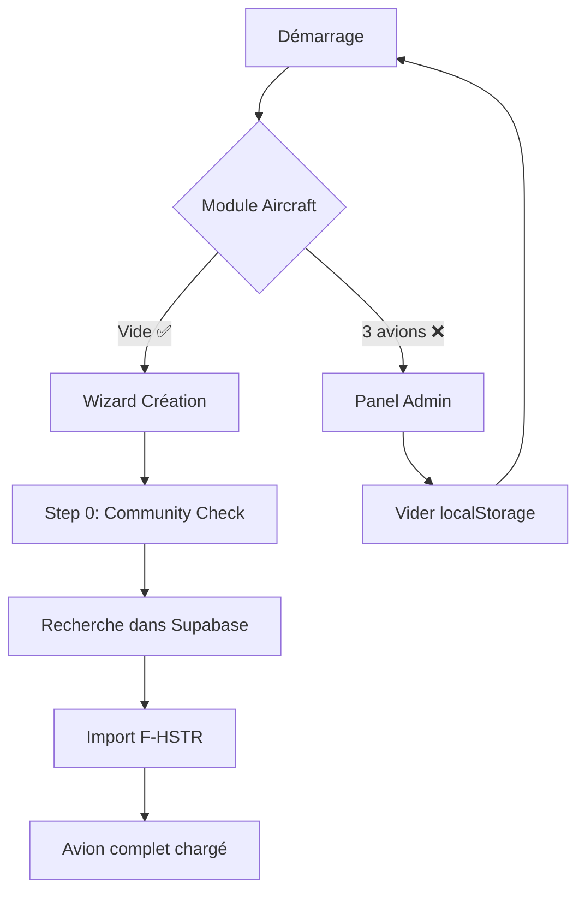

# ✈️ Solution: Module Aircraft Vide + Supabase

## 🎯 Problème

Au lancement, 3 avions apparaissent dans le module Aircraft alors que `DEFAULT_AIRCRAFT_LIST = []`. Ces avions sont stockés dans le **localStorage** et réapparaissent à chaque démarrage.

## ✅ Solution

### Architecture cible

```
┌─────────────────────┐
│   Module Aircraft   │  ← VIDE au démarrage
│   (localStorage)    │
└──────────┬──────────┘
           │
           │ Wizard d'importation
           ↓
┌─────────────────────┐
│     Supabase        │  ← Source de vérité
│  (Base centralisée) │  ← F-HSTR complet
└─────────────────────┘
```

### Étapes

#### 1. Nettoyer le localStorage ✅

**Via l'interface Admin** (recommandé):
1. Ouvrir http://localhost:4002
2. Onglet **"Admin"** (premier onglet)
3. Bouton **"Vider le localStorage"**
4. ✅ Backup automatique créé

**Via console navigateur**:
```javascript
localStorage.setItem('aircraft-storage', JSON.stringify({
  state: { aircraftList: [], selectedAircraftId: null },
  version: 0
}));
location.reload();
```

#### 2. Vérifier Supabase ✅

F-HSTR est déjà dans Supabase:
- **ID**: `0bda59c9-61bc-4a29-bacf-115159957607`
- **Registration**: F-HSTR
- **Model**: DA40NG
- **Taille**: 306 KB (données complètes)

Dashboard: https://supabase.com/dashboard/project/bgmscwckawgybymbimga

#### 3. Importer depuis Supabase 🚀

1. Module **"Gestion Avions"**
2. **"+ Nouvel Avion"** → Wizard
3. **Step 0: Community Check**
4. Rechercher **"F-HSTR"**
5. **"Importer"**

L'avion complet sera chargé avec tous ses paramètres!

## 📁 Fichiers créés

```
D:\Applicator\alflight\
├── src/features/admin/
│   └── AdminPanel.jsx                     ← Panel admin dans l'app
├── scripts/
│   ├── migrate-to-supabase.js            ← Migration automatique
│   ├── clear-local-aircraft.js           ← Nettoyage localStorage
│   └── fhstr-aircraft-only.json          ← Données F-HSTR extraites
├── MIGRATION_SUPABASE.md                  ← Documentation complète
└── README_AIRCRAFT_CLEAN.md               ← Ce fichier
```

## 🔧 Scripts utiles

### Lancer l'app

```bash
D:\Applicator\alflight\START_SESSION.bat
# Ou
cd D:\Applicator\alflight && npm run dev
```

→ App sur http://localhost:4002

### Migrer un avion vers Supabase

```bash
cd D:\Applicator\alflight
node scripts/migrate-to-supabase.js
```

### Nettoyer localStorage (script)

```bash
node scripts/clear-local-aircraft.js
```

## 🎓 Workflow recommandé



## ⚡ Quick Start

1. **Nettoyer**:
   ```
   http://localhost:4002 → Admin → Vider localStorage
   ```

2. **Importer**:
   ```
   Gestion Avions → Wizard → Community → F-HSTR → Import
   ```

3. **Vérifier**:
   ```
   Module Aircraft → 1 avion (F-HSTR avec tous les paramètres)
   ```

## 🔍 Vérifications

### localStorage est vide?

```javascript
JSON.parse(localStorage.getItem('aircraft-storage'))
// → { state: { aircraftList: [], selectedAircraftId: null }, version: 0 }
```

### F-HSTR dans Supabase?

```
Dashboard → Table Editor → community_presets → Rechercher "F-HSTR"
```

### Wizard fonctionne?

```
Gestion Avions → Wizard → Step 0
→ Liste des avions communautaires visible?
```

## 📊 Résultat attendu

| Avant | Après |
|-------|-------|
| 3 avions au démarrage | 0 avion au démarrage ✅ |
| F-HSTR incomplet | F-HSTR complet depuis Supabase ✅ |
| Données en localStorage | Données centralisées Supabase ✅ |
| Pas de source de vérité | Supabase = source unique ✅ |

## 🆘 Support

- Documentation complète: `MIGRATION_SUPABASE.md`
- Logs Google Sheets: https://docs.google.com/spreadsheets/d/1Y26_Zf7-jHPgpjWasubXpzQE-k0eMl0pHIMpg8OHw_k

---

✅ **Statut**: Migration terminée - F-HSTR disponible dans Supabase
📅 **Date**: 2025-10-07
